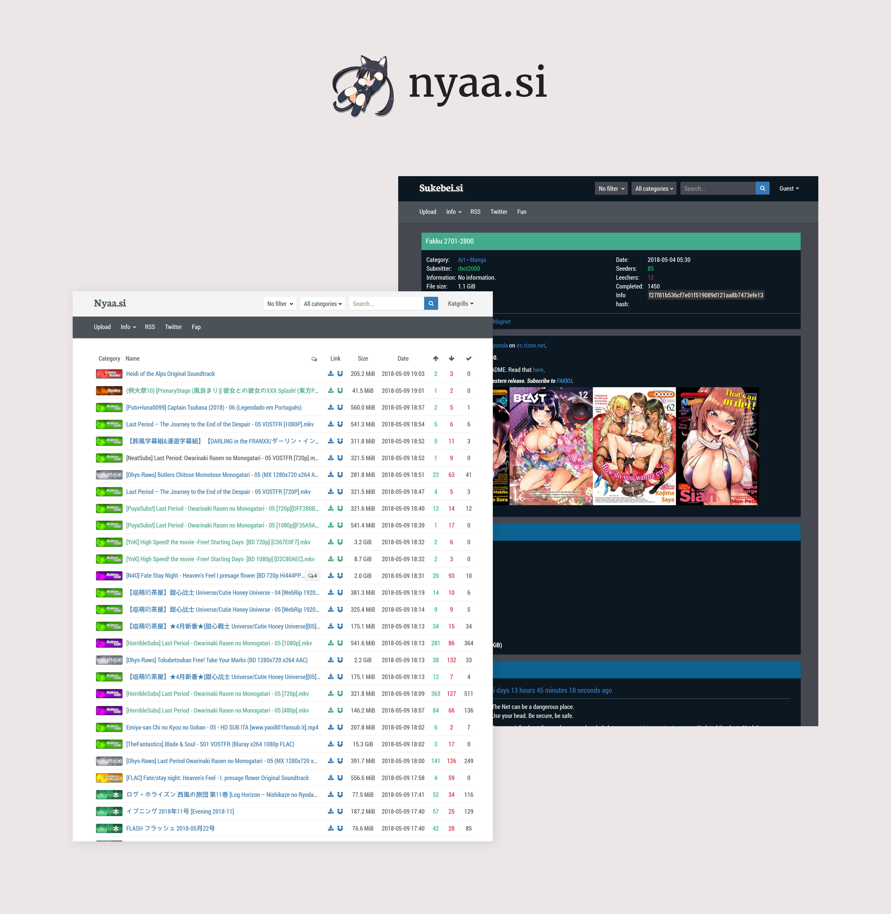

# Donut-S

Preview of <i>Donut-S</i>.

About
-------------------------------

<i>Donut-S</i> is an userstyle for <i>Nyaa</i>.

User styles are CSS code designed to alter the appearance of one, some, or all sites.

Instruction
-------------------------------

<strong>Step 1 : Install Stylus</strong> 

Depending of your browser.
+ for <a href="https://addons.mozilla.org/en-US/firefox/addon/styl-us/">Mozilla Firefox</a></li>
+ for <a href="https://chrome.google.com/webstore/detail/stylus/clngdbkpkpeebahjckkjfobafhncgmne?hl=en">Google Chrome</a>
+ for <a href="https://addons.opera.com/en-gb/extensions/details/stylus/?display=en">Opera</a>

<strong>Step 2 : Install the script </strong>
+ Via <b>userstyles</b> : <a href="https://userstyles.org/styles/159697/donut-s-dark-nyaa-css">Dark theme</a> or <a href="https://userstyles.org/styles/159698/donut-s-light-nyaa-css">Light theme</a>
+ Or directly with <b>Stylus</b> : <a href="https://raw.githubusercontent.com/Catgrills/Donut-S/master/donut-s.user.css">click here</a>

<strong>Step 3 : Install the font </strong>

I use several fonts for my custom stylesheet.
<ol>
<li> <a href="https://www.fontsquirrel.com/fonts/bebas-neue">Bebas Neue</a></li>
<li> <a href="http://www.freejapanesefont.com/bokutachi-gothic-2-bold/">Bokutachi no Gothic 2 </a></li>
<li> <a href="https://www.fontsquirrel.com/fonts/merriweather">Merriweather</a></li>
<li> <a href="https://www.fontsquirrel.com/fonts/roboto">Roboto</a></li>
</ol>

<strong>Step 4 : Show your appreciation </strong>
<ol>
<li>Feel free to comment this submission (critique, suggestion, compliment, etc).</li>
<li>If you like my works, don't hesitate to watch me.</li>
<li>You can share it, but don't forget to mention me.</li>
</ol>

Report
-------------------------------

Don't hesitate to report any issues you find while using this userstyle.
